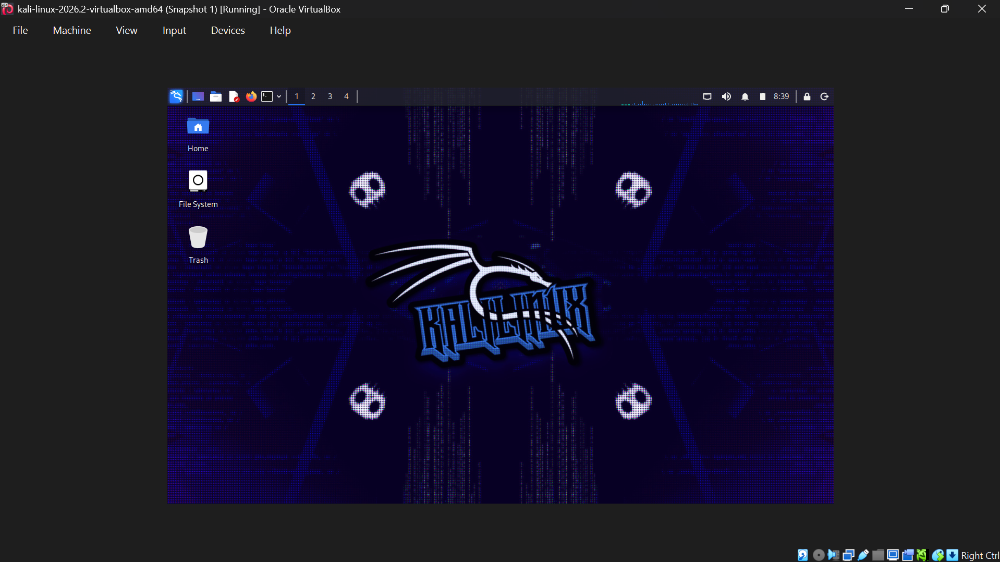
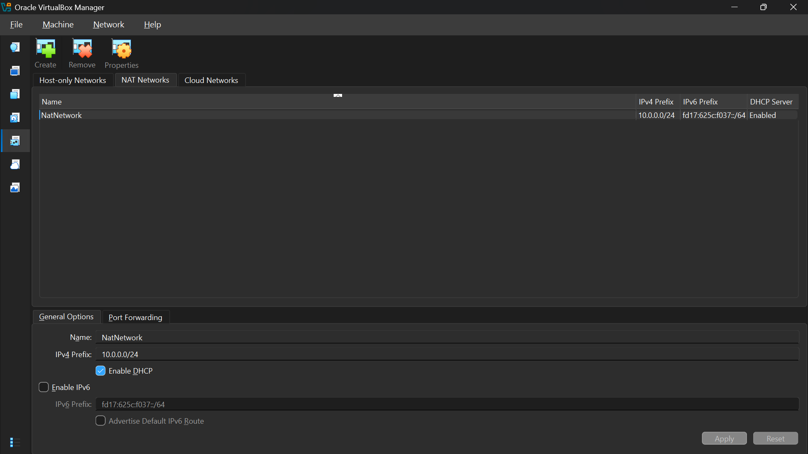
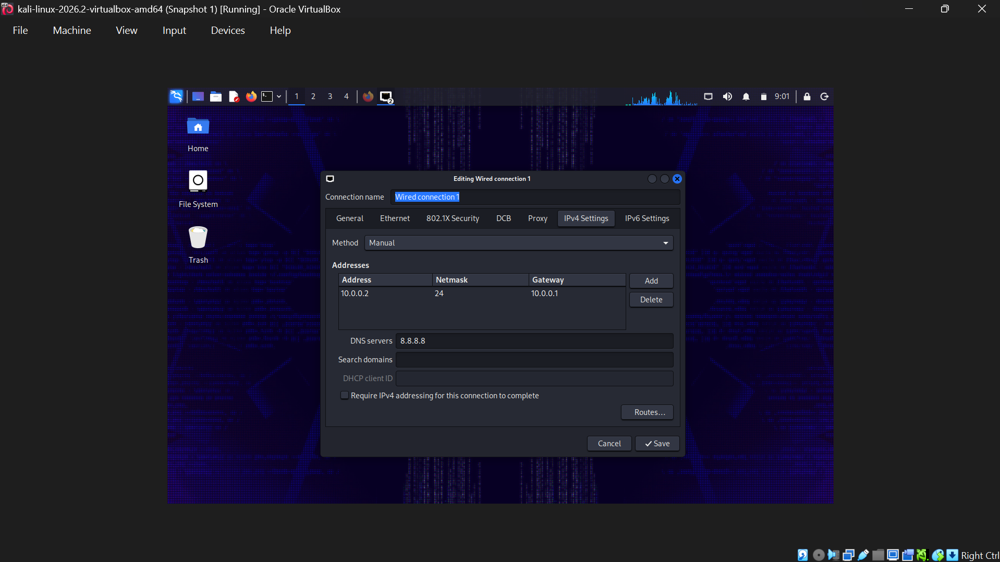
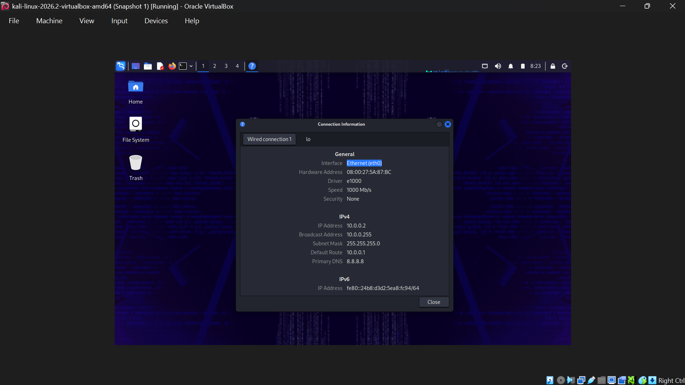

# 🔐 Cybersecurity Lab Environment Setup

**My personal cybersecurity lab for hands-on practice with network security, pentesting tools, and vulnerable machines.**

   

     

## 📌 Project Overview
This project focuses on setting up a **Cybersecurity and penetration-testing laboratory** using VirtualBox and Kali Linux.

The lab is designed to provide a secure and repeatable environment for conducting cybersecurity operations such as network scanning, reconnaissance, vulnerability analysis, and other security-testing practices.

The lab operates within a private virtual network, allowing for the future addition of machines that can serve as designated targets for authorized security testing.

---


## 🎯 Objectives
- Install and configure VirtualBox.
- Install/import Kali Linux as a virtual machine.
- Create a private **NAT Network** for the cybersecurity lab.
- Configure network connectivity for Kali Linux.
- Assign a consistent IP address to the Kali VM.
- Verify network connectivity and DNS resolution.
- Take a clean VM snapshot for recovery.
- Document the complete setup process.
- Prepare the environment for future cybersecurity projects.


## 🛡️ Purpose of the Lab
The lab offers a secure, isolated environment designed for cybersecurity education and authorized security testing.
It can also be used for activities such as:
- Password-cracking practice
- Firewall configuration and testing
- Intrusion detection and prevention exercises
- Malware analysis in a sandboxed setup
- Phishing and social engineering simulations
- Security patch deployment and validation
- Log monitoring and incident response drills
- Digital forensics and evidence collection

  ## ⚙️ Lab Configuration

| 🧩 Component       | ⚙️ Configuration   |
| ----------------- | ------------------ |
| 🖥️ Host OS        | Windows 11 pro        |
| 🧠 Host RAM        | 16 GB               |
| ⚡ Processor       | Intel Core i5      |
| 🧰 Hypervisor      | VirtualBox 7.2     |
| 🐉 Security OS     | Kali Linux 2026.2  |
| 🧠 Kali RAM        | 4251 MB            |
| 🌐 Virtual Network | NAT Network        |
| 📡 Network Address | 10.0.0.0/24        |
| 🐧 Kali IP Address | 10.0.0.2/24        |
| 🚪 Default Gateway | 10.0.0.1           |
| 🌍 DNS Server      | 8.8.8.8            |
| 🔮 Future VM Range | 10.0.0.3–10.0.0.99 |

---


 


 
## 🔎 Lab Verification
 
| ✅ Test                        | 🧾 Command                      | 🎯 Expected Result              |
| ------------------------------ | -------------------------------- | -------------------------------- |
| 🌐 Check IP address            | `ip a`                            | Correct Kali IP displayed        |
| 📡 Test gateway                | `ping 10.0.0.1`                   | Successful replies               |
| 🌍 Test internet connectivity  | `ping 8.8.8.8`                    | Successful replies               |
| 🔎 Test DNS resolution         | `nslookup networkwalks.com`       | Domain resolves                  |
| 🔄 Verify snapshot             | Restore snapshot, then run `ip a` | Baseline configuration restored  |
 
**Example results:**
 
```
IP Address: 10.0.0.2/24
Gateway:    10.0.0.1
DNS:        8.8.8.8
```
 

 
## 🐞 Problems Encountered & Solutions
 
### Problem -- No Internet Access on Kali VM
 
[After importing the Kali Linux VM and attaching it to the NAT Network, the VM received an IP address but had no internet connectivity. Pings to the gateway succeeded, but pings to external addresses (e.g., 8.8.8.8) timed out.

Commands used to diagnose:

```
sudo nmcli connection modify "Wired connection 1" ipv4.dad-timeout 0
```
 

 
---
 
## 💡 What I Learned
 
**1. NAT vs. NAT Network**
[I learned that a NAT Network lets multiple VMs share internet access while also communicating with each other, unlike a standard NAT adapter which isolates each VM.]
 
**2. Virtual Machine Networking**
[I got more comfortable diagnosing VM connectivity using tools like ip a and ping instead of assuming the network would just work.]
 
**3. Static IP Configuration**
[Assigning a static IP taught me why consistent addressing matters for documenting and referencing hosts in a lab environment]
 
**4. VM Snapshots**
[I learned that taking a clean snapshot before further changes gives me a safe recovery point if something breaks later.]
 
**5. Documentation**
[Writing notes as I worked showed me how much detail gets lost if documentation is left until after the fact.]
 
---
 
## 🔐 Security & Ethical Use
 
This lab is intended strictly for educational purposes. 
 
---
 
## 🔗 Tools & Resources
 
- **7-Zip** — <https://7-zip.org/download.html>
- **VirtualBox** — <https://virtualbox.org/wiki/Downloads>
- **Kali Linux** — <https://kali.org/get-kali>
---
 
## 👤 Author
 
**ADEWUYI GODWIN OLUWAPELUMI**
Cybersecurity Intern
 
LinkedIn: [www.linkedin.com/in/godwin-adewuyi-58244236b]
 
---
 
**Program:** Cybersecurity at Networkwalks  | **Week:** 01 |  **Project:** Cybersecurity & Pentesting Lab Setup  |  **Repository:** GitHub
 
